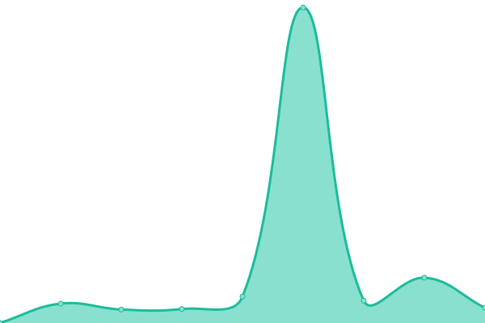
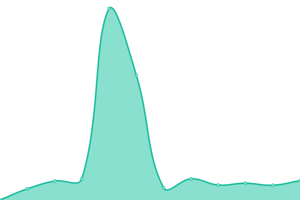

# [📈 Live Status](https://demo.upptime.js.org): <!--live status--> **🟧 Partial outage**

This repository contains the open-source uptime monitor and status page for [Lorenzo Ortiz](https://demo.upptime.js.org), powered by [Upptime](https://github.com/upptime/upptime).

With [Upptime](https://upptime.js.org), you can get your own unlimited and free uptime monitor and status page, powered entirely by a GitHub repository. We use [Issues](https://github.com/Infinitte/upptime/issues) as incident reports, [Actions](https://github.com/Infinitte/upptime/actions) as uptime monitors, and [Pages](https://demo.upptime.js.org) for the status page.

<!--start: status pages-->
<!-- This summary is generated by Upptime (https://github.com/upptime/upptime) -->
<!-- Do not edit this manually, your changes will be overwritten -->
<!-- prettier-ignore -->
| URL | Status | History | Response Time | Uptime |
| --- | ------ | ------- | ------------- | ------ |
|  [Home Assistant Mairena](https://kabble.duckdns.org/) | 🟩 Up | [home-assistant-mairena.yml](https://github.com/Infinitte/upptime/commits/HEAD/history/home-assistant-mairena.yml) | 

 600ms
     
 | 

<a href="https://Infinitte.github.io/upptime/history/home-assistant-mairena">99.73%</a>
    

|  [Home Assistant Arco](https://peque.duckdns.org/) | 🟩 Up | [home-assistant-arco.yml](https://github.com/Infinitte/upptime/commits/HEAD/history/home-assistant-arco.yml) | 

 464ms
     
 | 

<a href="https://Infinitte.github.io/upptime/history/home-assistant-arco">100.00%</a>
    

|  [Pi-KVM](https://pikvm.kabble.duckdns.org) | 🟥 Down | [pi-kvm.yml](https://github.com/Infinitte/upptime/commits/HEAD/history/pi-kvm.yml) | 

 3143ms
     
 | 

<a href="https://Infinitte.github.io/upptime/history/pi-kvm">99.14%</a>
    

|  [Guacamole](https://guacamole.kabble.duckdns.org/#/) | 🟥 Down | [guacamole.yml](https://github.com/Infinitte/upptime/commits/HEAD/history/guacamole.yml) | 

 2040ms
     
 | 

<a href="https://Infinitte.github.io/upptime/history/guacamole">99.50%</a>
    

<!--end: status pages-->

[**Visit our status website →**](https://demo.upptime.js.org)

## 📄 License

- Powered by: [Upptime](https://github.com/upptime/upptime)
- Code: [MIT](./LICENSE) © [Lorenzo Ortiz](https://demo.upptime.js.org)
- Data in the `./history` directory: [Open Database License](https://opendatacommons.org/licenses/odbl/1-0/)
